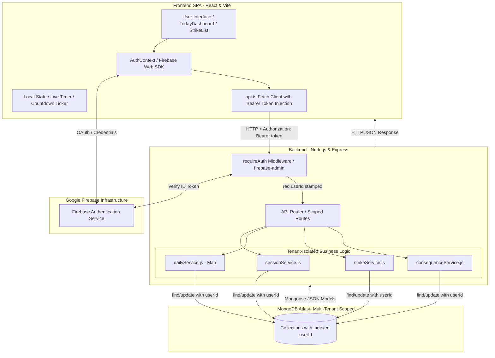
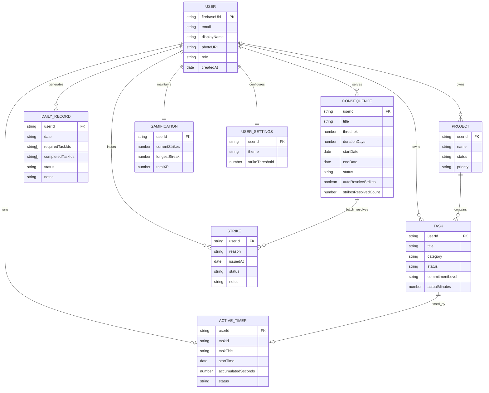
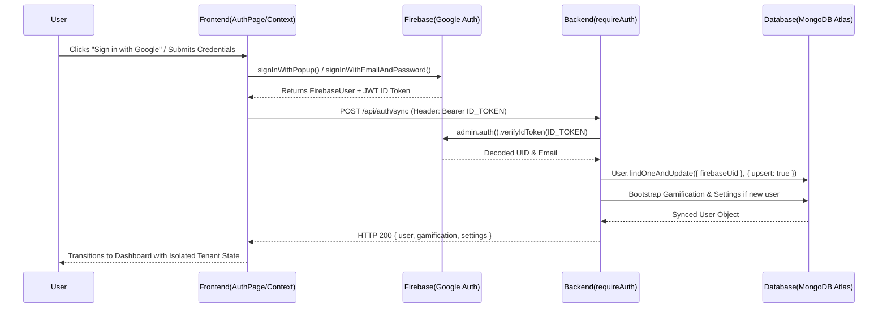
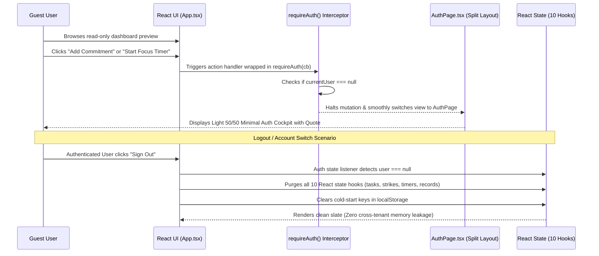
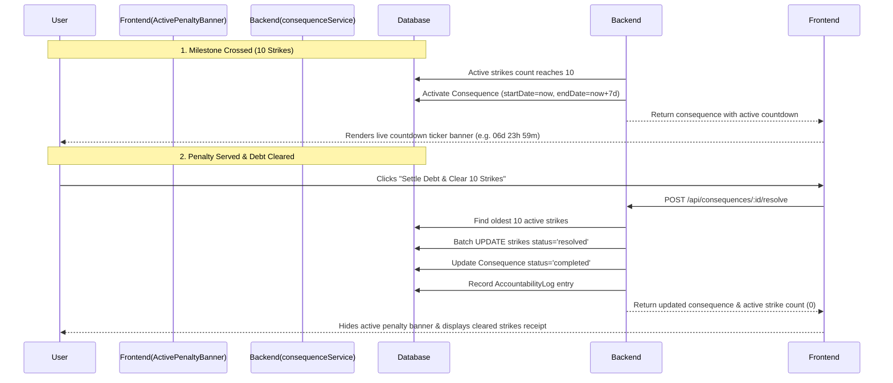
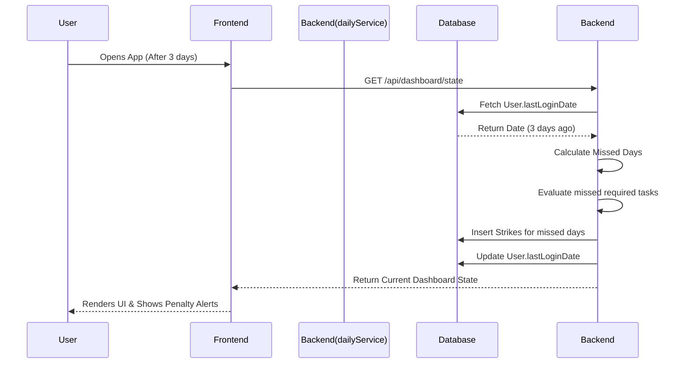
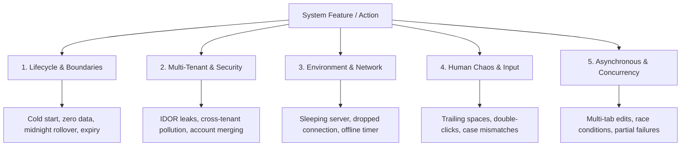

# Get It Done (GID) - Interview Preparation Notes

This document contains a comprehensive breakdown of the "Get It Done" project, tailored for software engineering interviews. It covers the product, technology stack, architecture, and specific design decisions.

---

## 1. Project Overview
**What is it?**
Get It Done (GID) is a brutalist, anti-procrastination task manager. Unlike standard to-do lists that focus on "feel-good" productivity, GID enforces strict timeboxing, tracks real-time analytics, and imposes severe accountability systems (including real-world consequences and penalties) to force execution of tasks.

**Core Features:**
- **Required vs. Optional:** Tasks are divided into mandatory commitments and optional backlog.
- **Live Timeboxing:** Tracks exact minutes worked against estimated durations with persistent active session state.
- **Accountability Engine:** Issues automated "strikes" for failing to complete required tasks, categorized chronologically by date.
- **Duration-Based Penalty Tracker:** Milestone consequences (e.g., 10 strikes = 7-day social detox) featuring second-by-second live countdown tickers.
- **Automated Strike Debt Batch-Resolution:** Automatic clearing and auditing of triggering strikes once penalties are served.
- **Dynamic Goals:** Tracks specific metrics (e.g., number of DSA questions solved) and links them to rewards.

---

## 2. Technology Stack & Justification

### Frontend
- **Tech:** React, TypeScript, Vite, TailwindCSS, Framer Motion, Lucide React, Firebase Web SDK (v10+).
- **Why React?** Component-based architecture allows for reusability of UI elements (task cards, timers, modals) and efficient DOM updates via the Virtual DOM.
- **Why TypeScript?** Adds static typing to JavaScript, catching bugs at compile-time (e.g., ensuring task objects have the correct properties) and providing superior developer experience and autocompletion.
- **Why Vite?** Replaces tools like Create React App (Webpack) to provide lightning-fast local development with instant Hot Module Replacement (HMR) and optimized production builds via esbuild/Rollup.
- **Why TailwindCSS?** A utility-first CSS framework that allows for rapid styling directly within the component file. It is perfect for enforcing the stark, "brutalist" aesthetic with precise control without managing separate CSS files.
- **Why Firebase Auth (Client)?** Provides drop-in, enterprise-grade authentication with email/password, password reset flows, and one-click Google OAuth via `signInWithPopup`, handling token refreshing and cryptographic credential storage out of the box with zero maintenance.

### Backend
- **Tech:** Node.js, Express.js, Firebase Admin SDK (`firebase-admin/auth`).
- **Why Node.js?** Allows for a unified language (JavaScript/TypeScript) across the entire stack. Its event-driven, non-blocking I/O model is highly efficient for handling numerous concurrent API requests (like logging timer sessions or fetching analytics).
- **Why Express.js?** A minimalist and flexible framework for Node.js that makes setting up RESTful API routes, middleware (CORS, body parsing, auth verification), and controllers incredibly fast and straightforward.
- **Why Firebase Admin SDK?** Enables zero-trust backend token verification (`auth.verifyIdToken(token)`). The backend cryptographically validates the caller's identity without storing passwords, managing refresh tokens, or trusting client-supplied user IDs.

### Database
- **Tech:** MongoDB Atlas (NoSQL) with Mongoose.
- **Why MongoDB?** The flexible, JSON-like document structure naturally maps to frontend JavaScript objects. It allows the schema to evolve easily as new task properties or user settings are added.
- **Why Mongoose?** Provides an Object Data Modeling (ODM) environment, adding a layer of structure, schema validation, and strictness over MongoDB, ensuring data integrity before it hits the database.
- **Logical Multi-Tenancy:** Single MongoDB database where all collections are logically partitioned with an indexed `userId: { type: String, required: true, index: true }`, ensuring complete data isolation at the query layer.

---

## 3. High-Level Design (HLD) & Architecture

The application follows a **Secured Client-Server RESTful Architecture with Multi-Tenant Isolation**:

1. **Presentation Layer (Frontend):** 
   - A Single Page Application (SPA) built with React.
   - Manages local state (timer ticks, live countdown tickers, UI modals, form inputs).
   - Wrapped in `AuthContext` providing reactive user authentication state, automatic JWT token management, and guest action interception.
   - Intercepts outgoing requests in `api.ts` to inject `Authorization: Bearer <idToken>`.
2. **Security & Authentication Layer (Backend Middleware):**
   - Express server intercepts incoming REST requests.
   - `requireAuth` middleware extracts the Bearer token, validates it against Google Firebase Public Keys via `firebase-admin/auth`, and securely stamps `req.userId` and `req.userEmail` on the request object.
3. **Business Logic Layer (Backend Services & Controllers):**
   - Routes requests to tenant-aware controllers and services (e.g., `strikeService.js`, `consequenceService.js`, `dailyService.js`, `sessionService.js`).
   - Maintains per-user cache maps (e.g. daily rollover evaluation cache) to prevent cross-tenant processing collisions.
4. **Data Access Layer (Database):**
   - Services interact with Mongoose **Models** (e.g., `User.js`, `Task.js`, `Strike.js`, `Consequence.js`, `ActiveTimer.js`).
   - Every read, write, update, and delete operation is strictly scoped by `{ userId: req.userId }`, preventing Insecure Direct Object References (IDOR).

---

## 4. Low-Level Design (LLD) & Key Components

- **Authentication & Multi-Tenancy Architecture**
  - `User.js`: User model storing `firebaseUid`, `email`, `displayName`, `photoURL`, `role` (`'user'` | `'admin'`), and metadata timestamps.
  - `middleware/auth.js`: Zero-trust authentication middleware verifying Bearer tokens and populating `req.userId`.
  - `routes/auth.js`: User provisioning (`POST /api/auth/sync`) which automatically creates the user document and bootstraps default `Gamification` and `UserSettings` on first login, and `GET /api/auth/me`.
  - `AuthContext.tsx`: React context supplying `user`, `loading`, `loginWithEmail`, `registerWithEmail`, `loginWithGoogle`, `sendPasswordReset`, and `logout`.
  - `AuthPage.tsx`: Minimalist light-mode 50/50 split authentication page with responsive layouts, motivational quotes, tabbed login/register/forgot-password forms, and one-click Google Sign-In.
- **Models (`backend/models/`)**
  - `Task.js`: Defines task schema (`title`, `category`, `duration`, `isRequired`, `status`, `metrics`, `rescheduleHistory`, and indexed `userId`).
  - `Strike.js`: Schema for accountability infractions (`userId`, `date`, `reason`, `taskId`, `status`: `'active'` | `'resolved'`, `resolutionNotes`).
  - `Consequence.js`: Schema for strike threshold penalties (`userId`, `title`, `description`, `threshold`, `durationDays`, `status`: `'pending'` | `'active'` | `'completed'`, `startDate`, `endDate`, `autoResolveStrikes`, `strikesResolvedCount`).
  - `ActiveTimer.js`: Document tracking currently running focus session per user (`userId`, `taskId`, `taskTitle`, `startTime`, `accumulatedSeconds`, `status`: `'running'` | `'paused'`).
  - `Gamification.js`: Tracks user game mechanics, active strikes, monetary penalties, and `longestStreak` all-time personal best per `userId`.
- **Services (`backend/services/`)**
  - `dailyService.js`: Tenant-isolated daily rollover (`lastEvaluatedDateByUser` map), analytics, retroactive miss evaluation, and daily summary computation.
  - `strikeService.js`: User-scoped strike issuance logic, active strike count aggregation, and automatic consequence trigger checks when thresholds are crossed.
  - `consequenceService.js`: User-scoped penalty lifecycle management, consequence creation, and batch strike settlement upon penalty resolution.
  - `sessionService.js`: Handles session logs per user, converting elapsed seconds to worked minutes and updating task metrics.
- **Frontend Components (`frontend/src/features/`)**
  - `TodayDashboard.tsx`: Primary dashboard combining mandatory commitments, active timer banner, live penalty ticker, left-column Yesterday Recap and Daily Review note, top 4 "Where I Left Off" project cards, and clean optional backlog.
  - `AnalyticsDashboard.tsx`: Weekly retrospective cockpit featuring 7/14/30-day window telemetry, "Where You Excelled" vs "Where You Lagged", category discipline matrix, estimation calibration, and accurate real-time in-progress classification for Today.
  - `StrikeList.tsx`: Chronologically grouped strike viewer (Today, Yesterday, Date headers) with search and status filtering (`All`, `Active`, `Resolved`).
  - `ActivePenaltyBanner.tsx`: Global high-visibility banner featuring real-time second-by-second countdown (`XXd XXh XXm XXs`), progress bar, and one-click strike settlement.
  - `ConsequenceModal.tsx`: Form modal to customize strike thresholds, penalty actions, duration presets (1d, 3d, 7d, 14d, 30d), and automated debt clearance toggles.
  - `Navbar.tsx`: Global navigation bar with dynamic backend sleep/operational indicator, luminous glowing streak badge, live elapsed focus timer, clock, user avatar, and one-click Sign In / Sign Out button.

---

## 5. Key Interview Talking Points (Business Logic & Problem Solving)

If an interviewer asks about complex problems solved in this app, bring up these points:

### Problem 1: The "Avoidance" Loop (Handling missed days)
**Challenge:** If a user knows they will get penalized (strikes) for failing to complete tasks, they might just avoid logging into the app for a few days to dodge the penalty. How do you prevent this without running expensive, continuous cron jobs for inactive users?  
**Solution:** A **Retroactive Penalty System** (Lazy Evaluation).
- Instead of checking every user at midnight, the backend evaluates penalties lazily. 
- When a user logs in, the system checks their `lastLoginDate`. If there is a gap of days (e.g., they skipped 3 days), the backend intercepts the dashboard load, retroactively processes those 3 missed days, applies the appropriate strikes for their incomplete mandatory tasks, and *then* returns the current day's state. 
- **Benefit:** Saves massive server resources while maintaining strict accountability.

### Problem 2: Live Focus Timer: Client Presentation vs. Single Source of Truth
**Challenge:** How do you keep a live ticking timer on the UI responsive every second without introducing timer drift, double-speed bugs, or spamming the database with writes?  
**Solution:** Decoupled timestamp math and session-end persistence.
- **The State Desync Bug:** If the top-level app state maintains `elapsedSeconds` in an interval and the child component also adds `(Date.now() - startTime)` to `elapsedSeconds`, the timer runs at **2x speed**.
- **The Fix:** The timer display calculation must strictly be a pure function of:
  $$\text{Display Time} = \text{accumulatedSeconds} + (\text{now} - \text{startTime})$$
  starting strictly from base `accumulatedSeconds` (from paused intervals).
- **Single Source of Truth:** The database is never touched every second. When the user clicks **"Stop & Record"**, the backend computes the final duration directly from server timestamps (`new Date() - timer.startTime`) and writes a single `TaskSession` record. Even if client clocks desync, database records remain 100% accurate.

### Problem 3: Milestone Penalty Tracking & Automated Debt Clearance
**Challenge:** Users getting overwhelmed with 10 or 20 individual strikes will abandon the system if they have to resolve each strike manually one by one. Conversely, having no consequences makes strikes toothless.  
**Solution:** **Threshold-Based Consequence Pipeline with Batch Debt Settlement**.
1. **Auto-Trigger:** When active strikes reach a configurable threshold (e.g., 10 strikes), `strikeService.js` activates the consequence and stamps `startDate = now` and `endDate = now + durationDays`.
2. **Live Countdown:** The frontend renders an unmissable countdown ticker across tabs, instilling accountability and urgency.
3. **Batch Settlement:** Once the penalty duration is served, resolving the consequence triggers a backend batch transaction:
   - Queries the oldest 10 unresolved strikes.
   - Batch-updates them to `status: 'resolved'` with audit note: `"Auto-resolved by completing penalty: [Title]"`.
   - Decrements active strike debt in a single operation, eliminating manual friction while maintaining an immutable audit log.

### Problem 4: Dynamic Metric Tracking (e.g., LeetCode/DSA)
**Challenge:** Tasks are abstract, but sometimes a user wants to track specific metrics (like "number of questions solved") and link them to goals.  
**Solution:** Context-aware task completion.
- When a task tagged with the category "DSA" is marked complete, the frontend UI dynamically prompts the user: *"How many questions did you solve?"*
- This metric is sent to the backend, which logs it against the task and simultaneously updates any active `Goal` object that listens for the "DSA Questions" metric threshold, automatically unlocking rewards if conditions are met.

### Problem 5: Free-Tier Serverless Sleep & Resilient Session Queuing
**Challenge:** Cloud providers like Render put free-tier web services to sleep after 15 minutes of inactivity. When a user runs a 30–60 minute focus session, the client is silent, causing the backend to spin down. Clicking "Stop" causes cold-start timeouts (50–90s delay), frozen UI buttons, or lost session data.  
**Solution:** A **Timer-Bound Heartbeat** combined with an **Optimistic Client-Side Session Queue**.
1. **Targeted Keep-Alive Heartbeat:** Instead of running an expensive 24/7 pinger that wastes free instance quotas, the client strictly sends a lightweight ping (`/api/health`) every 9 minutes *only while an active timer is running*. Once stopped, the pinging stops and the server is allowed to sleep normally.
2. **Optimistic Stop with Guaranteed Zero Data Loss:** When the user clicks "Stop", the UI halts the timer immediately and records the pending session payload into `localStorage`. The client attempts the API call with exponential retry backoff. If the server is mid-boot or the user reloads, the app automatically drains the pending queue upon reconnection, ensuring tracked work is never lost.

### Problem 6: Multi-Roundtrip Network Bottlenecks & On-Demand Lazy Loading
**Challenge:** A centralized dashboard firing 10 parallel endpoints across a cloud database (MongoDB Atlas) introduces 30–40 sequential round-trips (2–3 seconds initial latency even on local setups).  
**Solution:** **Tiered Lazy Loading, Rollover Caching, and Query Parallelization**.
1. **On-Demand Tab Hydration:** On initial load, the client only fetches the immediate viewport (Today Dashboard + Active Timer + Settings). Secondary tabs (Analytics, Goals, Rewards, Backlog) are hydrated on-demand only when selected.
2. **Rollover Caching:** The backend daily rollover (`evaluatePastDays(7)`) only runs once per calendar day. Subsequent requests to `/api/daily/today` skip redundant date checks.
3. **Database Concurrency & Lean Documents:** Independent dashboard queries run concurrently via `Promise.all` using `.lean()`, cutting response latency by ~70%.

### Problem 7: Data-Driven Retrospective Cockpit & Free-Tier DB Protection
**Challenge:** Users need actionable visibility into where they lagged, excelled, and misestimated time across multi-week cycles, but querying unbounded historical timelines on free-tier MongoDB Atlas clusters causes RAM exhaustion and sluggish aggregations.  
**Solution:** **Bounded Multi-Period Windows (7/14/30 Days) with Mathematical Calibration**.
1. **Hard Query Bounds:** Telemetry is strictly capped at `7d`, `14d`, and `30d` windows. Unbounded "All-Time" full table scans are prohibited, guaranteeing minimal database memory footprint.
2. **True Commitment Adherence vs Optional Tasks:** Incomplete tasks moved by midnight evaluations to `missedTaskIds` are unioned with `requiredTaskIds` to compute true non-negotiable discipline rates ($\frac{\text{Completed Required}}{\text{Planned Required}}$) rather than naive total task counts.
3. **Category Discipline Matrix:** Color-codes field health (`EXCELLING` = Emerald, `ON TRACK` = Indigo, `NEEDS FOCUS` = Amber) based on category-specific commitment fulfillment rather than raw time alone.
4. **Estimation Variance Calibration:** Excludes auto-generated zero-estimate project work sessions to eliminate false positive estimation drift.

### Problem 8: Deterministic Streak Engine with Rest-Day Continuity & Best Streak Tracking
**Challenge:** Naive streak implementations either count any day with an app visit (meaningless vanity metric) or penalize users when they take planned rest days, causing demotivation and abandonment.  
**Solution:** **Strict 100% Adherence Rule with Break-Day Pauses and Historical Best Persistence**.
1. **Strict Adherence:** A day only counts toward an active streak if 100% of mandatory daily commitments were completed. Any missed required task resets active streak to `0`.
2. **Rest-Day Freeze ("I Did Nothing Today"):** When a user triggers "I did nothing today" (`status: 'no_progress'`), the streak engine pauses progression. The streak neither increases nor decreases, preserving continuity across intentional rest without penalty.
3. **Immutable Best-Streak Preservation:** The backend evaluates chronological daily records to determine all-time peak consecutive days and permanently persists `longestStreak` in MongoDB `Gamification`, ensuring personal records survive future streak breaks.

### Problem 9: Sleep-Aware Backend System Status with Zero-Waste Quota Policy
**Challenge:** Free cloud hosts (Render) put idle instances to sleep after 15 minutes. Users often don't know whether the backend is online or sleeping, but setting up a continuous 24/7 pinger quickly burns through the 750 free monthly compute hours.  
**Solution:** **Event-Driven Connection Interception with One-Click Wakeup**.
1. **Passive Interception:** Frontend network adapters intercept fetch calls. When a network error, timeout, or 502 occurs, the UI immediately flips to `○ Standby / Sleeping`. Any `HTTP 200` response instantly flips it to `● Operational`.
2. **One-Click Handshake:** When in standby, the System Status pill in the Navbar becomes an interactive trigger. Clicking it fires a 4-second probe to `/api/health` to spin up the instance and re-hydrates the application without requiring a full browser reload.
3. **Timer Keep-Alive Harmony:** When an active focus timer is ticking, the 9-minute heartbeat keeps the instance alive so work is never dropped mid-session, completely halting when the timer stops.

### Problem 10: Logical Multi-Tenancy & Zero-Trust Route Scoping in an Existing Monolith
**Challenge:** How do you migrate an existing, functional single-tenant application with active production data to a multi-tenant model without breaking live user workflows, causing cross-tenant data leaks, or maintaining separate databases?  
**Solution:** **Logical Data Partitioning with Zero-Trust Query Middleware and User-Keyed Background Services**.
1. **Zero-Trust Token Verification (`requireAuth`):** Every incoming REST request passes through `firebase-admin/auth` middleware. The middleware validates the JWT cryptographic signature, extracts the Google/Firebase UID, and securely populates `req.userId` and `req.userEmail`.
2. **Universal Schema Scoping:** All 13 Mongoose models (`Task`, `Project`, `Strike`, `Consequence`, `DailyRecord`, `TaskSession`, `Note`, `Gamification`, `UserSettings`, `Goal`, `Reward`, `AccountabilityLog`, `ActiveTimer`) were updated to include indexed `userId: { type: String, required: true, index: true }`.
3. **Defense-in-Depth Query Isolation:** Every controller, service method, and Mongoose query strictly scopes operations by `{ userId: req.userId }`. Even if a malicious actor guesses or brute-forces another user's MongoDB `ObjectId` (`_id`), operations like `findByIdAndUpdate` or `deleteOne` return `404 Not Found` because the tenant constraint is not satisfied.
4. **Isolating Per-User Background Rollover Caching:** In single-tenant mode, the backend tracked midnight rollover using a simple global variable `lastEvaluatedDate`. In multi-tenant mode, this would introduce a severe bug: when User A logs in, `lastEvaluatedDate` updates to today, causing the server to skip rollover evaluation when User B logs in from another timezone. This was replaced with a user-keyed cache map (`lastEvaluatedDateByUser.set(userId, todayStr)` in `dailyService.js`).
5. **Threshold & Penalty Isolation:** Consequence threshold checks (`strikeService.js`) and batch strike settlements (`consequenceService.js`) strictly query active strikes for `req.userId`, preventing one user's infractions from triggering penalties for another.

### Problem 11: Zero-Leak In-Memory State Purge & Guest Action Interception Flow
**Challenge:** In single-page applications (SPAs), React state persists in client memory across component lifecycles. When User A logs out and User B logs in (or a guest browses the site), stale in-memory state can cause cross-user data flashing, privacy leaks, or crashes when mutating unauthenticated records. Conversely, completely locking out guests behind a hard paywall destroys product discovery.  
**Solution:** **Full In-Memory State Purging paired with a Centralized Guest Action Interceptor (`requireAuth`)**.
1. **Zero-Leak In-Memory State Purge:** In `App.tsx`, an auth state watcher monitors Firebase user changes. When a user logs out or switches accounts, the application explicitly triggers a complete reset across all 10 core React state hooks (`tasks`, `projects`, `strikes`, `consequences`, `activeTimer`, `gamification`, `userSettings`, `dailyRecord`, `todaySummary`, and search filters), while purging cold-start cache keys in `localStorage`.
2. **Frictionless Guest Preview Mode:** Unauthenticated visitors are greeted with a clean, fully interactive preview of the GID brutalist interface rather than an abrupt blocking modal. They can inspect the layout, explore tabs, view the retrospective structure, and understand the accountability philosophy.
3. **Centralized Action Guard (`requireAuth`):** Any mutating or stateful action—such as clicking "Add Task", "Start Focus Timer", "Mark Complete", "Add Project", or "Update Consequence"—is wrapped in a lightweight `requireAuth(actionCallback)` guard. If unauthenticated, execution halts immediately and smoothly switches the view to the clean Light Split Auth screen (`AuthPage.tsx`), preserving the user's intent without throwing 401 network errors or corrupting client state.

### Problem 12: Dual-Layer Optional Backlog Caching vs. Long-Term Task Retention
**Challenge:** Anti-procrastination design demands zero clutter on the primary focus dashboard. When users complete one-time optional tasks from their "Optional Backlog" accordion, leaving completed tasks with strike-throughs clutters the daily workspace. However, deleting them or dropping their records permanently breaks retrospective velocity calculations, streak accountability, and historical audit trails in the Task Directory.  
**Solution:** **Dual-Layer Contextual Backlog Partitioning**.
1. **Context-Aware API Filtering (`/api/daily/today`):** In `backend/routes/index.js`, the daily dashboard data pipeline dynamically filters out completed one-time tasks (`status === 'completed' && recurrence === 'none'`). Only pending optional tasks or active recurring tasks remain in the daily backlog view.
2. **Frontend Redundant Shield (`TodayDashboard.tsx`):** A client-side defense-in-depth filter replicates this logic on local state arrays, ensuring optimistic updates immediately clear completed one-time tasks from Today's view without awaiting network roundtrips.
3. **Zero Data Loss in Task Directory:** All completed tasks remain permanently stored in MongoDB Atlas and remain fully accessible under the dedicated "Tasks" view when filtering by `"Completed"` or `"All"`. This preserves full historical integrity, category statistics, and retrospective analytics while maintaining a razor-sharp daily focus dashboard.

### Problem 13: Accurate In-Progress Analytics Telemetry vs. Premature "Rest Day" Fallback
**Challenge:** In the Analytics retrospective cockpit, the 7-day and 30-day activity charts visualize daily performance as Completed (green), Partial (orange), or Rest (red/gray). Users noticed that whenever they opened the app in the morning or mid-day, Today's bar was always rendered as a red "REST" day (`no_progress`), despite having scheduled commitments. This caused cognitive dissonance and penalized active users before their workday had even unfolded.  
**Solution:** **Dynamic Current-Day In-Progress Classification**.
1. **The Root Cause:** In `dailyService.js` and `backend/routes/index.js`, historical dates without completed tasks or active minutes defaulted to `record?.status = 'no_progress'` (the rest day fallback). Applying this historical logic indiscriminately to the current, active calendar day caused unrecorded morning minutes to be diagnosed as an intentional rest day.
2. **Dynamic `isToday` State Partitioning:** The backend aggregation loop now specifically detects the current calendar date (`isToday`). Unless the user has explicitly clicked the intentional "I DID NOTHING TODAY" button, Today is classified as:
   - `'completed'`: If all today's mandatory commitments are checked off.
   - `'partial'`: If some tasks are finished or focus timer minutes have been recorded.
   - `'in_progress'`: If the day is currently active and commitments are pending.
3. **Frontend Telemetry Calibration (`AnalyticsDashboard.tsx`):** The client bar chart renders a neutral in-progress styling with active commitment indicators (e.g. `0/3`, `1/3`), and updates the hover tooltip to reflect `"In Progress"` status. Only deliberate, user-confirmed rest days display the red "REST" badge.

---

## 6. Diagrams & Flowcharts

### System Architecture Flowchart



### Entity-Relationship (ER) Diagram



### Firebase Multi-Tenant Authentication & Verification Flow



### Guest Interception & Zero-Leak State Purge Flow



### Penalty Lifecycle & Batch Resolution Flow



### The "Avoidance Loop" Penalty Sequence



---

## 7. Recent Architectural Hardening & Production Refinements (Phase 7)

### 1. Minimalist Light Split Auth Cockpit (`AuthPage.tsx`)
- **Aesthetic Overhaul:** Replaced the legacy dark popup modal (`AuthModal.tsx`) with an expansive 50/50 split-screen authentication experience. 
- **Design Philosophy:** Features a crisp off-white canvas (`bg-stone-50`), bold brutalist typography, and an inspiring quote: *"Discipline is the bridge between goals and accomplishment." ~ Jim Rohn*.
- **Unified Flow:** Seamlessly toggles between Login, Registration, and Password Reset with inline error feedback alerts and a 1-click Google OAuth button (`signInWithPopup`).
- **Smooth Navigation:** Includes a top-bar "Continue as Guest" escape hatch, returning users to the read-only dashboard preview.

### 2. Dashboard Ergonomics & Anti-Endless Scrolling (`TodayDashboard.tsx`)
- **Left-Column Reflection Cockpit:** Relocated "Yesterday's Recap" and the "Daily Review Note" into the left sidebar beneath Today's Commitments. Users immediately review yesterday's infractions/achievements and draft reflections without hunting at the bottom of the page.
- **Top 4 Project Focus ("Where I Left Off"):** Sliced the active project list to display only the top 4 most recently active projects. Added a prominent `View All Projects →` link leading directly to the dedicated Projects tab, eliminating endless vertical scroll.
- **Direct Persistence for Daily Reflections:** Wired the Daily Review note directly to `POST /api/daily/note`, persisting notes into `DailyRecord.notes` scoped by `userId`.

### 3. Dual-Layer Optional Backlog Cleanup
- **Decluttering Today's View:** Completed one-time optional tasks (`status === 'completed' && recurrence === 'none'`) are filtered out from Today's Optional Backlog accordion on both the backend endpoint (`/api/daily/today`) and the frontend client.
- **Permanent Task Retention:** All completed one-time tasks remain fully visible in the dedicated Tasks view under "Completed" and "All", safeguarding historical reporting and streak metrics.

### 4. Real-Time Telemetry Calibration for Today's Bar (`AnalyticsDashboard.tsx`)
- **Eliminated False "REST" Diagnosis:** Separated current-day tracking (`isToday`) from historical evaluation in `/api/analytics`. Unrecorded morning minutes no longer default to `no_progress`.
- **Live In-Progress Telemetry:** Today's bar now renders neutral in-progress styling, reflects real-time commitment completion (`0/3`, `1/3`, `3/3`), and displays "In Progress" on hover unless the user explicitly declared "I DID NOTHING TODAY".

### 5. Zero-Data-Loss Legacy Migration
- **Preserved Existing History:** Executed a non-destructive migration script that claimed 10 tasks, 6 projects, 4 strikes, daily records, notes, and gamification metrics under the master user (`5gAs8um6YDOq65ew3o59L2AW9012`).
- **Automated Backup Preservation:** Retained `backend/scripts/backupData.js` for standalone JSON snapshot backups of all collections.

---

## 8. Edge Case Engineering: Mental Framework & Multi-Tenant Auth

### The 5 Lenses of Edge-Case Thinking
When designing software architectures, engineers don't guess edge cases randomly—they systematically stress-test features across five distinct dimensional lenses:



#### 1. Lifecycle & State Boundary Lens
* **Definition:** Questions what happens at the extreme edges of an entity's existence: creation (0 state), limits (infinity / 100%), and destruction (deletion).
* **Questions to Ask:**
  * What does the screen show when a user has 0 tasks, 0 strikes, 0 history?
  * What happens at 11:59:59 PM vs 12:00:01 AM during streak evaluation?
  * What happens if an active timer hits 24 hours without the user stopping it?

#### 2. Multi-Tenant & Security Boundary Lens (IDOR & Scoping)
* **Definition:** Verifies that no user can read, mutate, or deduce data belonging to another tenant.
* **Questions to Ask:**
  * If User A guesses the Mongo `_id` of User B's task, can `PUT /api/tasks/:id` update it? (*Prevention: Always query `{ _id: req.params.id, userId: req.userId }`*).
  * If User A creates a project named "Work", does it collide with User B's project named "Work"? (*Prevention: Compound index `{ userId: 1, name: 1 }`*).

#### 3. Environment & Hardware Lens
* **Definition:** Assumes the physical world is unreliable: connections drop, free-tier servers sleep, browser tabs get throttled.
* **Questions to Ask:**
  * Render free tier sleeps after 15 minutes of inactivity; what if a user stops their timer while the server is waking up? (*Prevention: Optimistic local state persistence*).
  * What if user switches from Wi-Fi to cellular while logging a task session?

#### 4. Human Chaos & Client Input Lens
* **Definition:** Assumes users are distracted, make typos, and operate on mobile touchscreens with aggressive autocorrect.
* **Questions to Ask:**
  * **Email Casing & Whitespace:** Mobile keyboards often capitalize the first letter (`Alex@gmail.com`) and add trailing spaces (`alex@gmail.com `). Without `.trim().toLowerCase()`, a user will create two separate accounts and report "lost data".
  * **Rapid Double-Clicks:** Clicking "Complete Task" or "Start Timer" 5 times in 200ms creates race conditions and duplicate entries.

#### 5. Concurrency & Multi-Tab Lens
* **Definition:** Users frequently open multiple browser tabs simultaneously.
* **Questions to Ask:**
  * If Tab A has an active focus timer and Tab B logs out, what happens when Tab A tries to stop the timer? (*Prevention: Never wipe memory abruptly on 401; buffer unsaved session to `localStorage` and request re-auth*).

---

### Multi-Tenant Auth Architecture: Zero-Data-Loss Migration Protocol
For an existing system with active production data, transitioning to multi-tenant auth must follow a **Zero-Data-Loss Protocol**:

```
[Phase 0: Pre-Migration Snapshot]
   mongodump / JSON Export of all collections -> Timestamped backup
          │
          ▼
[Phase 1: Admin Account Bootstrap]
   User creates primary account (e.g. owner@example.com) -> Obtains master userId
          │
          ▼
[Phase 2: Non-Destructive In-Place Assignment]
   Execute non-destructive Mongoose query:
   Task.updateMany({ userId: { $exists: false } }, { $set: { userId: masterId } })
   Gamification.updateMany({ userId: "default_user" }, { $set: { userId: masterId } })
          │
          ▼
[Phase 3: Verification & Count Audit]
   Assert: Total records before == Total records assigned to masterId
          │
          ▼
[Phase 4: Enable Strict Scoping Middleware]
   Turn on requireAuth and tenant filtering across all REST endpoints
```

> **Safety Guarantee:** `$set` strictly adds the missing `userId` attribute. It NEVER deletes, overwrites, or modifies any existing title, streak, duration, strike, or note.

---

### Admin Role & Privileges: Do You Need It?
In a personal productivity platform, an admin role is not strictly necessary for day-to-day operations, but implementing a simple `role: 'user' | 'admin'` flag on the `User` schema provides critical future-proofing:

| Potential Admin Capability | Purpose | Is It Needed Now? |
| :--- | :--- | :--- |
| **Data Claiming & Migration** | Linking unassigned legacy documents to the first owner | **Yes (One-time tool)** |
| **System Health & DB Telemetry** | Viewing database collection sizes, active timer count | Nice to have |
| **User Data Mutation** | Editing another user's tasks or strikes | **No (Anti-pattern)** |
| **Spam / Account Purge** | Deleting inactive or malicious accounts | Only if app goes viral |

---

### Authentication Service: Firebase Auth vs. Self-Hosted / Google Cloud

| Feature | Firebase Authentication (Spark Plan) | Google Cloud Console + Custom JWT |
| :--- | :--- | :--- |
| **Cost** | 100% Free up to 50,000 Monthly Active Users | 100% Free forever |
| **Google Sign-In** | 1-line client SDK (`signInWithPopup`) | Requires OAuth redirect URL routing, exchange codes |
| **Password Reset** | Automated email dispatch by Google infrastructure | Requires setting up SendGrid/Resend SMTP API keys |
| **Token Refresh** | Automatic background silent refresh in SDK | Must manually manage refresh tokens & cookies |
| **Code Modularity** | Abstracted behind `authService.ts` (easily swappable) | Custom Express auth controller |
| **Recommendation** | **Recommended for speed, reliability & zero maintenance** | Good if avoiding third-party vendor lock-in |

---

## 9. Feature Deep-Dive: Quests (Periodic Milestone Commitments)

### The Origin Story: The Monthly Resume Forcing Function
The concept of **Quests** was born from a personal habit reflection: wanting to update my resume once every month. 

I realized that updating a resume every month isn't just about editing a document—it's a powerful psychological **forcing function**. If you commit to updating your resume every single month, you are motivated to actively learn something new, build a project, or master a new skill each month just so you have something real and meaningful to write down.

### From Inspiration to System Architecture
This spark of motivation led to a bigger architectural realization:
1. **Periodic Cadence Tasks:** There are important recurring milestones in life—updating your resume, reviewing monthly finances, paying recurring utility bills, dental checkups, or conducting personal retrospectives—that do not belong in everyday task backlogs.
2. **The Danger of Strike/Streak Pollution:** In GID's deterministic accountability model, mandatory tasks require 100% daily completion; failing any required task resets streaks to 0 and issues automated strikes. If a monthly milestone is treated as a daily task, missing it on a busy day causes unfair strikes and punishes the user.
3. **Decoupled Architecture:** Quests were designed as an isolated cadence engine:
   - They appear directly in the **Today Dashboard** beneath the Daily Commitments section when due.
   - They act as friendly, persistent reminders that stay with you until completed.
   - **Zero Strike / Zero Streak Impact:** They **never** increment daily required counts or trigger strikes/resets at midnight.
   - **Dual Schedule Mechanics:**
     - **Flexible Timing:** Repeats $N$ months after you complete it (e.g. 1 month after finishing your resume update).
     - **Exact Day of Month:** Always anchors to a specific calendar date (e.g. 5th of every month for bills or finances).
   - **7-Day Grace Window:**
     - If completed on-time or within 7 days of due date: preserves the fixed day anchor for the next month.
     - If completed $>7$ days late: restarts the 1-month cycle from the completion date to avoid compressed, back-to-back due dates.


