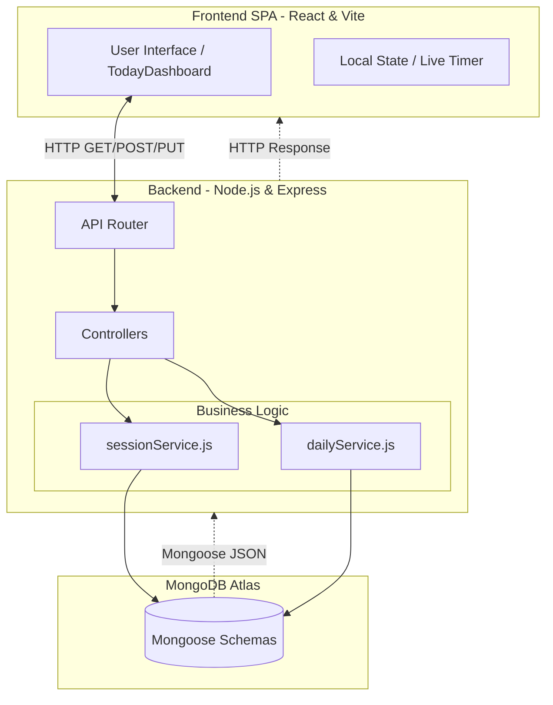
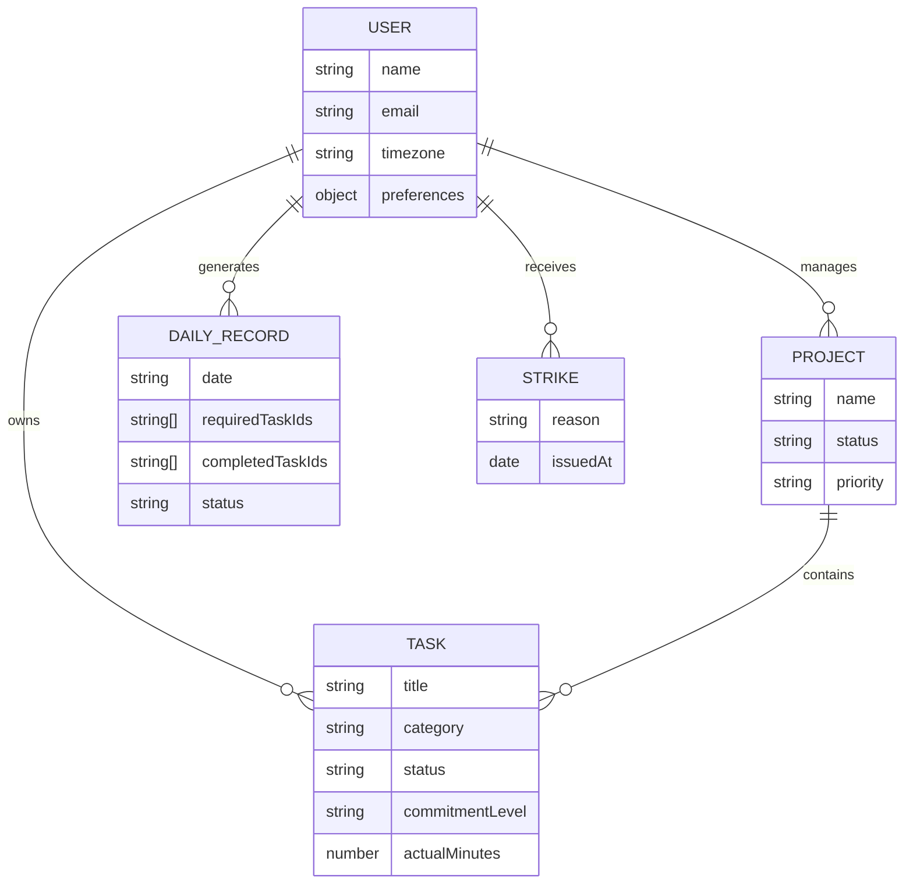
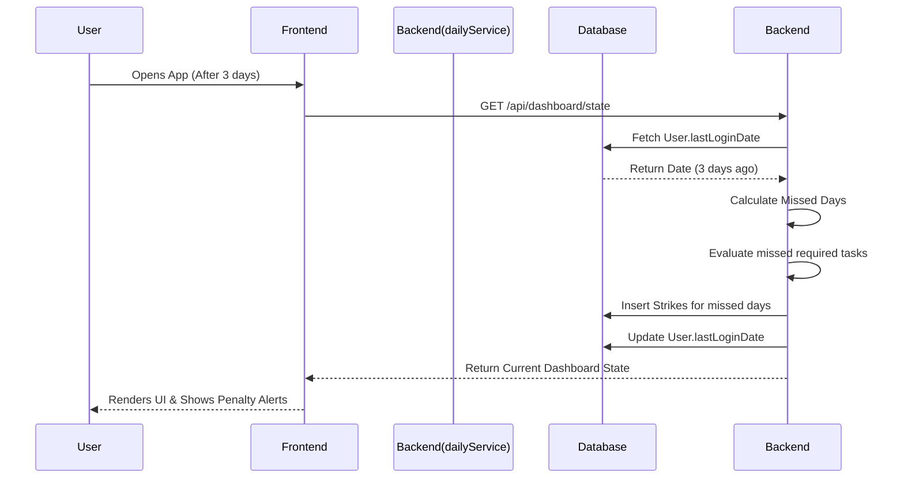

# Get It Done (GID) - Interview Preparation Notes

This document contains a comprehensive breakdown of the "Get It Done" project, tailored for software engineering interviews. It covers the product, technology stack, architecture, and specific design decisions.

---

## 1. Project Overview
**What is it?**
Get It Done (GID) is a brutalist, anti-procrastination task manager. Unlike standard to-do lists that focus on "feel-good" productivity, GID enforces strict timeboxing, tracks real-time analytics, and imposes severe accountability systems (including real-world consequences and penalties) to force execution of tasks.

**Core Features:**
- **Required vs. Optional:** Tasks are divided into mandatory commitments and optional backlog.
- **Live Timeboxing:** Tracks exact minutes worked against estimated durations.
- **Accountability Engine:** Issues automated "strikes" for failing to complete required tasks.
- **Dynamic Goals:** Tracks specific metrics (e.g., number of DSA questions solved) and links them to rewards.

---

## 2. Technology Stack & Justification

### Frontend
- **Tech:** React, TypeScript, Vite, TailwindCSS, Framer Motion, Lucide React.
- **Why React?** Component-based architecture allows for reusability of UI elements (task cards, timers, modals) and efficient DOM updates via the Virtual DOM.
- **Why TypeScript?** Adds static typing to JavaScript, catching bugs at compile-time (e.g., ensuring task objects have the correct properties) and providing superior developer experience and autocompletion.
- **Why Vite?** Replaces tools like Create React App (Webpack) to provide lightning-fast local development with instant Hot Module Replacement (HMR) and optimized production builds via esbuild/Rollup.
- **Why TailwindCSS?** A utility-first CSS framework that allows for rapid styling directly within the component file. It is perfect for enforcing the stark, "brutalist" aesthetic with precise control without managing separate CSS files.

### Backend
- **Tech:** Node.js, Express.js.
- **Why Node.js?** Allows for a unified language (JavaScript/TypeScript) across the entire stack. Its event-driven, non-blocking I/O model is highly efficient for handling numerous concurrent API requests (like logging timer sessions or fetching analytics).
- **Why Express.js?** A minimalist and flexible framework for Node.js that makes setting up RESTful API routes, middleware (CORS, body parsing), and controllers incredibly fast and straightforward.

### Database
- **Tech:** MongoDB Atlas (NoSQL) with Mongoose.
- **Why MongoDB?** The flexible, JSON-like document structure naturally maps to frontend JavaScript objects. It allows the schema to evolve easily as new task properties or user settings are added.
- **Why Mongoose?** Provides an Object Data Modeling (ODM) environment, adding a layer of structure, schema validation, and strictness over MongoDB, ensuring data integrity before it hits the database.

---

## 3. High-Level Design (HLD) & Architecture

The application follows a standard **Client-Server RESTful Architecture**:

1. **Presentation Layer (Frontend):** 
   - A Single Page Application (SPA) built with React.
   - Manages local state (timer ticks, UI modals, form inputs).
   - Communicates with the backend via HTTP requests (fetch/axios).
2. **Business Logic Layer (Backend):**
   - Express server intercepts requests.
   - Routes requests to specific controllers (e.g., TaskController, SessionController).
   - Controllers delegate complex business logic to **Services** (e.g., `dailyService.js`, `sessionService.js`).
3. **Data Access Layer (Database):**
   - Services interact with Mongoose **Models** (e.g., `Task.js`) to perform CRUD operations on MongoDB Atlas.

---

## 4. Low-Level Design (LLD) & Key Components

- **Models (`backend/models/`)**
  - `Task.js`: Schema defining task properties (title, category, duration, `isRequired` boolean, completion status, metrics logged).
- **Services (`backend/services/`)**
  - `dailyService.js`: Encapsulates logic for daily analytics, calculating completion rates, and managing daily summaries.
  - `sessionService.js`: Handles the logic for work sessions, tracking exactly how long a user spent on a specific task and updating the total accumulated time.
- **Frontend Components (`frontend/src/features/`)**
  - `TodayDashboard.tsx`: The core view component combining the task list, live timer, and daily analytics summary into a single, cohesive dashboard.

---

## 5. Key Interview Talking Points (Business Logic & Problem Solving)

If an interviewer asks about complex problems solved in this app, bring up these points:

### Problem 1: The "Avoidance" Loop (Handling missed days)
**Challenge:** If a user knows they will get penalized (strikes) for failing to complete tasks, they might just avoid logging into the app for a few days to dodge the penalty. How do you prevent this without running expensive, continuous cron jobs for inactive users?
**Solution:** A **Retroactive Penalty System** (Lazy Evaluation).
- Instead of checking every user at midnight, the backend evaluates penalties lazily. 
- When a user logs in, the system checks their `lastLoginDate`. If there is a gap of days (e.g., they skipped 3 days), the backend intercepts the dashboard load, retroactively processes those 3 missed days, applies the appropriate strikes for their incomplete mandatory tasks, and *then* returns the current day's state. 
- **Benefit:** Saves massive server resources while maintaining strict accountability.

### Problem 2: Dynamic Metric Tracking (e.g., LeetCode/DSA)
**Challenge:** Tasks are abstract, but sometimes a user wants to track specific metrics (like "number of questions solved") and link them to goals.
**Solution:** Context-aware task completion.
- When a task tagged with the category "DSA" is marked complete, the frontend UI dynamically prompts the user: *"How many questions did you solve?"*
- This metric is sent to the backend, which logs it against the task and simultaneously updates any active `Goal` object that listens for the "DSA Questions" metric threshold, automatically unlocking rewards if conditions are met.

### Problem 3: Live Timeboxing vs Database Writes
**Challenge:** Having a live timer ticking down on the frontend shouldn't spam the backend database every second to update the time.
**Solution:** Session-based batching.
- The frontend holds the live timer state locally in React. 
- The backend is only contacted when a distinct "Session" ends (e.g., the user clicks pause, finishes the task, or the timer hits zero). At that point, a single API payload containing `minutesWorked` is dispatched to `sessionService.js` to update the database.

---

## 6. Diagrams & Flowcharts

### System Architecture Flowchart

This flowchart illustrates the high-level data flow and client-server interaction.

### Entity-Relationship (ER) Diagram

This diagram visualizes the core MongoDB schemas and their conceptual relationships. 

### The "Avoidance Loop" Penalty Sequence

This sequence diagram illustrates how the lazy-evaluation handles users dodging logins to avoid penalties.

