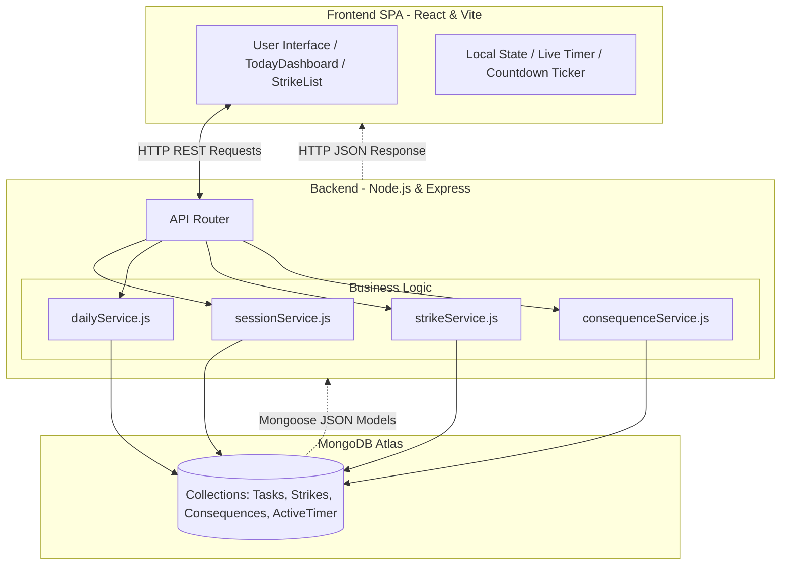
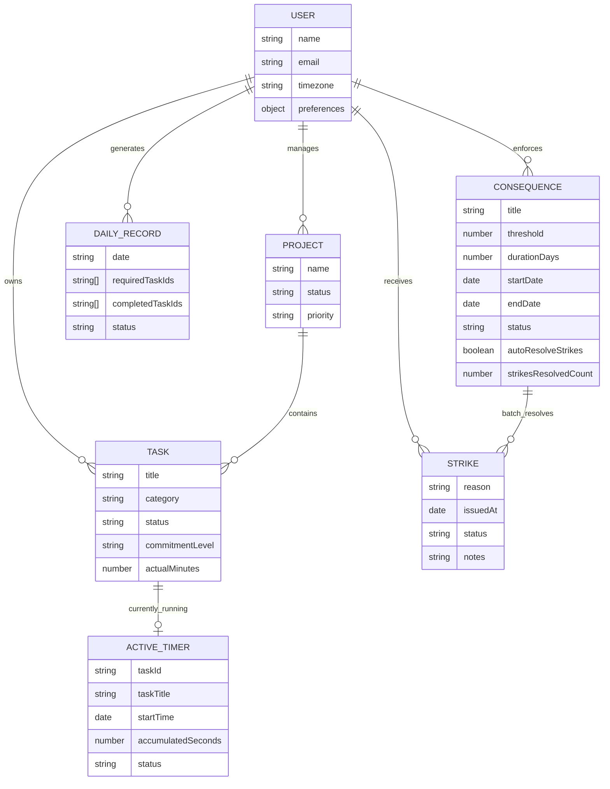
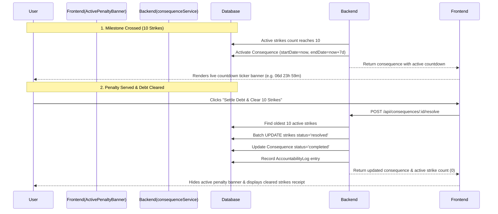
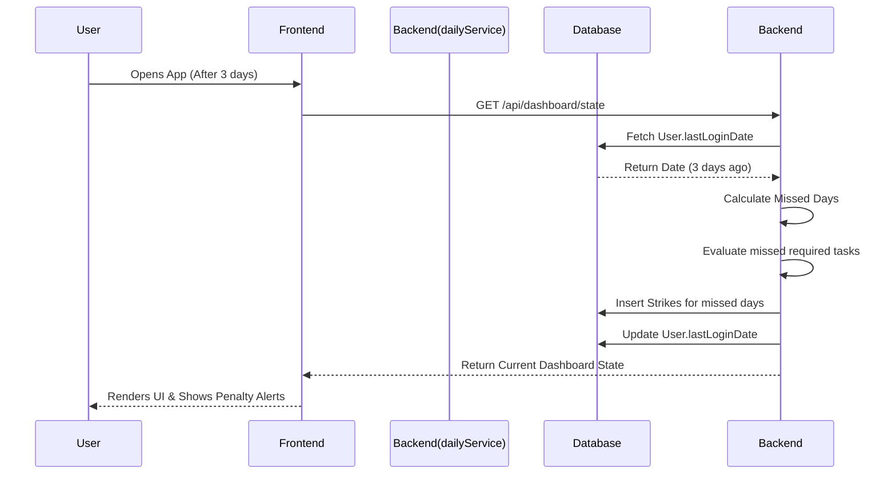

# Get It Done (GID) - Interview Preparation Notes

This document contains a comprehensive breakdown of the "Get It Done" project, tailored for software engineering interviews. It covers the product, technology stack, architecture, and specific design decisions.

---

## 1. Project Overview
**What is it?**
Get It Done (GID) is a brutalist, anti-procrastination task manager. Unlike standard to-do lists that focus on "feel-good" productivity, GID enforces strict timeboxing, tracks real-time analytics, and imposes severe accountability systems (including real-world consequences and penalties) to force execution of tasks.

**Core Features:**
- **Required vs. Optional:** Tasks are divided into mandatory commitments and optional backlog.
- **Live Timeboxing:** Tracks exact minutes worked against estimated durations with persistent active session state.
- **Accountability Engine:** Issues automated "strikes" for failing to complete required tasks, categorized chronologically by date.
- **Duration-Based Penalty Tracker:** Milestone consequences (e.g., 10 strikes = 7-day social detox) featuring second-by-second live countdown tickers.
- **Automated Strike Debt Batch-Resolution:** Automatic clearing and auditing of triggering strikes once penalties are served.
- **Dynamic Goals:** Tracks specific metrics (e.g., number of DSA questions solved) and links them to rewards.

---

## 2. Technology Stack & Justification

### Frontend
- **Tech:** React, TypeScript, Vite, TailwindCSS, Framer Motion, Lucide React.
- **Why React?** Component-based architecture allows for reusability of UI elements (task cards, timers, modals) and efficient DOM updates via the Virtual DOM.
- **Why TypeScript?** Adds static typing to JavaScript, catching bugs at compile-time (e.g., ensuring task objects have the correct properties) and providing superior developer experience and autocompletion.
- **Why Vite?** Replaces tools like Create React App (Webpack) to provide lightning-fast local development with instant Hot Module Replacement (HMR) and optimized production builds via esbuild/Rollup.
- **Why TailwindCSS?** A utility-first CSS framework that allows for rapid styling directly within the component file. It is perfect for enforcing the stark, "brutalist" aesthetic with precise control without managing separate CSS files.

### Backend
- **Tech:** Node.js, Express.js.
- **Why Node.js?** Allows for a unified language (JavaScript/TypeScript) across the entire stack. Its event-driven, non-blocking I/O model is highly efficient for handling numerous concurrent API requests (like logging timer sessions or fetching analytics).
- **Why Express.js?** A minimalist and flexible framework for Node.js that makes setting up RESTful API routes, middleware (CORS, body parsing), and controllers incredibly fast and straightforward.

### Database
- **Tech:** MongoDB Atlas (NoSQL) with Mongoose.
- **Why MongoDB?** The flexible, JSON-like document structure naturally maps to frontend JavaScript objects. It allows the schema to evolve easily as new task properties or user settings are added.
- **Why Mongoose?** Provides an Object Data Modeling (ODM) environment, adding a layer of structure, schema validation, and strictness over MongoDB, ensuring data integrity before it hits the database.

---

## 3. High-Level Design (HLD) & Architecture

The application follows a standard **Client-Server RESTful Architecture**:

1. **Presentation Layer (Frontend):** 
   - A Single Page Application (SPA) built with React.
   - Manages local state (timer ticks, live countdown tickers, UI modals, form inputs).
   - Communicates with the backend via HTTP requests (fetch/axios).
2. **Business Logic Layer (Backend):**
   - Express server intercepts requests.
   - Routes requests to specific controllers and services (e.g., `strikeService.js`, `consequenceService.js`, `dailyService.js`, `sessionService.js`).
3. **Data Access Layer (Database):**
   - Services interact with Mongoose **Models** (e.g., `Task.js`, `Strike.js`, `Consequence.js`, `ActiveTimer.js`) to perform atomic and batch operations on MongoDB Atlas.

---

## 4. Low-Level Design (LLD) & Key Components

- **Models (`backend/models/`)**
  - `Task.js`: Defines task schema (title, category, duration, `isRequired`, status, metrics, reschedule history).
  - `Strike.js`: Schema for accountability infractions (date, reason, taskId, status: `'active'` | `'resolved'`, resolution notes).
  - `Consequence.js`: Schema for strike threshold penalties (title, description, threshold e.g. 10 strikes, durationDays, status: `'pending'` | `'active'` | `'completed'`, `startDate`, `endDate`, `autoResolveStrikes`, `strikesResolvedCount`).
  - `ActiveTimer.js`: Singleton document tracking currently running focus session (`taskId`, `taskTitle`, `startTime`, `accumulatedSeconds`, `status`: `'running'` | `'paused'`).
- **Services (`backend/services/`)**
  - `dailyService.js`: Daily rollover, analytics, retroactive miss evaluation, and daily summary computation.
  - `strikeService.js`: Strike issuance logic, active strike count aggregation, and automatic consequence trigger checks when thresholds are crossed.
  - `consequenceService.js`: Penalty lifecycle management, consequence creation, and batch strike settlement upon penalty resolution.
  - `sessionService.js`: Handles session logs, converting elapsed seconds to worked minutes and updating task metrics.
- **Frontend Components (`frontend/src/features/`)**
  - `TodayDashboard.tsx`: Primary dashboard combining mandatory commitments, active timer banner, live penalty ticker, and daily note.
  - `StrikeList.tsx`: Chronologically grouped strike viewer (Today, Yesterday, Date headers) with search and status filtering (`All`, `Active`, `Resolved`).
  - `ActivePenaltyBanner.tsx`: Global high-visibility banner featuring real-time second-by-second countdown (`XXd XXh XXm XXs`), progress bar, and one-click strike settlement.
  - `ConsequenceModal.tsx`: Form modal to customize strike thresholds, penalty actions, duration presets (1d, 3d, 7d, 14d, 30d), and automated debt clearance toggles.
  - `Navbar.tsx`: Global navigation bar with active session indicator, live elapsed focus timer, and clock.

---

## 5. Key Interview Talking Points (Business Logic & Problem Solving)

If an interviewer asks about complex problems solved in this app, bring up these points:

### Problem 1: The "Avoidance" Loop (Handling missed days)
**Challenge:** If a user knows they will get penalized (strikes) for failing to complete tasks, they might just avoid logging into the app for a few days to dodge the penalty. How do you prevent this without running expensive, continuous cron jobs for inactive users?  
**Solution:** A **Retroactive Penalty System** (Lazy Evaluation).
- Instead of checking every user at midnight, the backend evaluates penalties lazily. 
- When a user logs in, the system checks their `lastLoginDate`. If there is a gap of days (e.g., they skipped 3 days), the backend intercepts the dashboard load, retroactively processes those 3 missed days, applies the appropriate strikes for their incomplete mandatory tasks, and *then* returns the current day's state. 
- **Benefit:** Saves massive server resources while maintaining strict accountability.

### Problem 2: Live Focus Timer: Client Presentation vs. Single Source of Truth
**Challenge:** How do you keep a live ticking timer on the UI responsive every second without introducing timer drift, double-speed bugs, or spamming the database with writes?  
**Solution:** Decoupled timestamp math and session-end persistence.
- **The State Desync Bug:** If the top-level app state maintains `elapsedSeconds` in an interval and the child component also adds `(Date.now() - startTime)` to `elapsedSeconds`, the timer runs at **2x speed**.
- **The Fix:** The timer display calculation must strictly be a pure function of:
  $$\text{Display Time} = \text{accumulatedSeconds} + (\text{now} - \text{startTime})$$
  starting strictly from base `accumulatedSeconds` (from paused intervals).
- **Single Source of Truth:** The database is never touched every second. When the user clicks **"Stop & Record"**, the backend computes the final duration directly from server timestamps (`new Date() - timer.startTime`) and writes a single `TaskSession` record. Even if client clocks desync, database records remain 100% accurate.

### Problem 3: Milestone Penalty Tracking & Automated Debt Clearance
**Challenge:** Users getting overwhelmed with 10 or 20 individual strikes will abandon the system if they have to resolve each strike manually one by one. Conversely, having no consequences makes strikes toothless.  
**Solution:** **Threshold-Based Consequence Pipeline with Batch Debt Settlement**.
1. **Auto-Trigger:** When active strikes reach a configurable threshold (e.g., 10 strikes), `strikeService.js` activates the consequence and stamps `startDate = now` and `endDate = now + durationDays`.
2. **Live Countdown:** The frontend renders an unmissable countdown ticker across tabs, instilling accountability and urgency.
3. **Batch Settlement:** Once the penalty duration is served, resolving the consequence triggers a backend batch transaction:
   - Queries the oldest 10 unresolved strikes.
   - Batch-updates them to `status: 'resolved'` with audit note: `"Auto-resolved by completing penalty: [Title]"`.
   - Decrements active strike debt in a single operation, eliminating manual friction while maintaining an immutable audit log.

### Problem 4: Dynamic Metric Tracking (e.g., LeetCode/DSA)
**Challenge:** Tasks are abstract, but sometimes a user wants to track specific metrics (like "number of questions solved") and link them to goals.  
**Solution:** Context-aware task completion.
- When a task tagged with the category "DSA" is marked complete, the frontend UI dynamically prompts the user: *"How many questions did you solve?"*
- This metric is sent to the backend, which logs it against the task and simultaneously updates any active `Goal` object that listens for the "DSA Questions" metric threshold, automatically unlocking rewards if conditions are met.

---

## 6. Diagrams & Flowcharts

### System Architecture Flowchart

### Entity-Relationship (ER) Diagram

### Penalty Lifecycle & Batch Resolution Flow

### The "Avoidance Loop" Penalty Sequence

